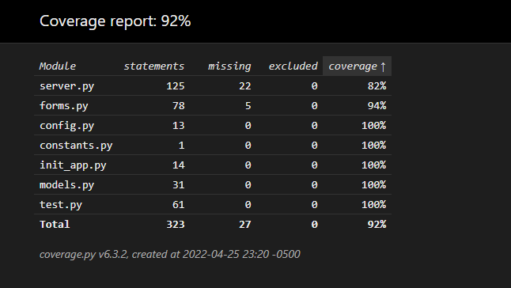

# To get started...
Install all dependencies for frontend with `yarn install` each time you're pulling a new commit 
Open a new terminal and enter `yarn start` to start the development server  
Ensure all dependencies are installed for Flask env (`pip install -r requirements.txt`) **virtual env must be active before running this command** 
If you're in the root directory you can start the api with `yarn api_win` or `yarn api_mac` depending on your OS 
## All good!

# Coverage Report

## To test the app yourself...
Ensure coverage is installed and the virtual environment is active (should be if you followed the getting started steps) 
Run the command `yarn test_api` to run the unit tests and see which tests pass/fail 
After running the tests you can either use `yarn report` (command line table) or `yarn web_report` (in depth review via html) to view the coverage report from the tests

